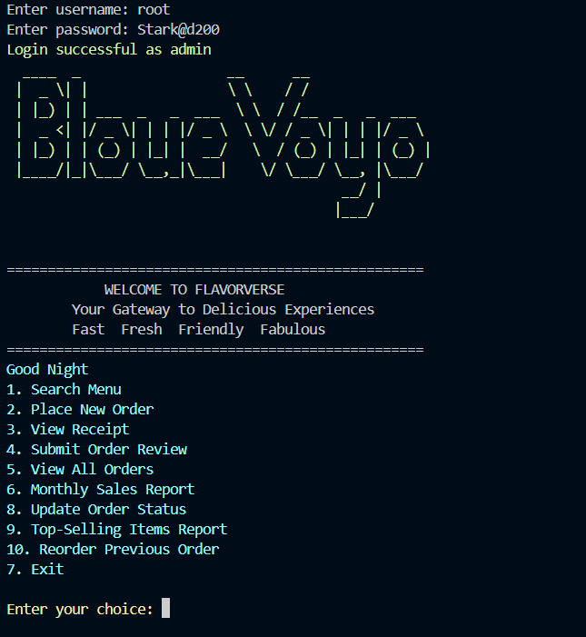
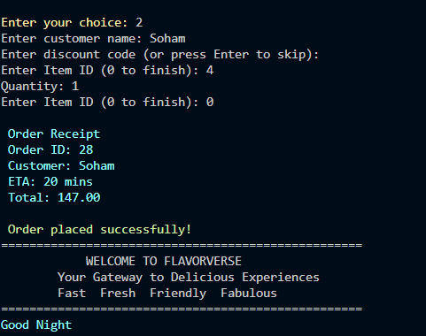
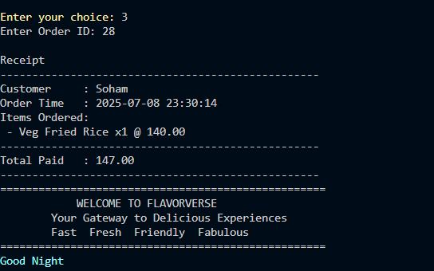
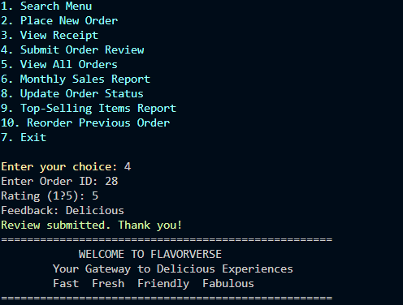
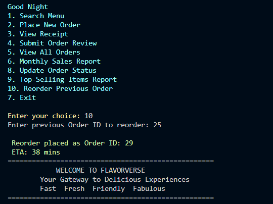
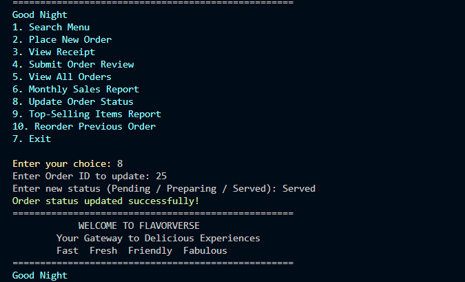
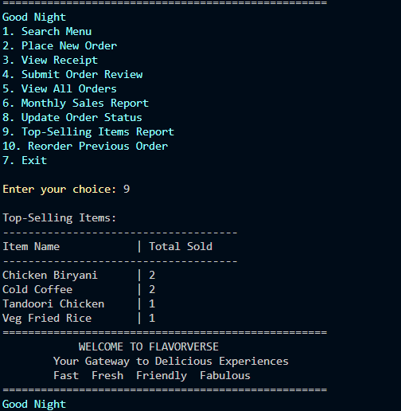
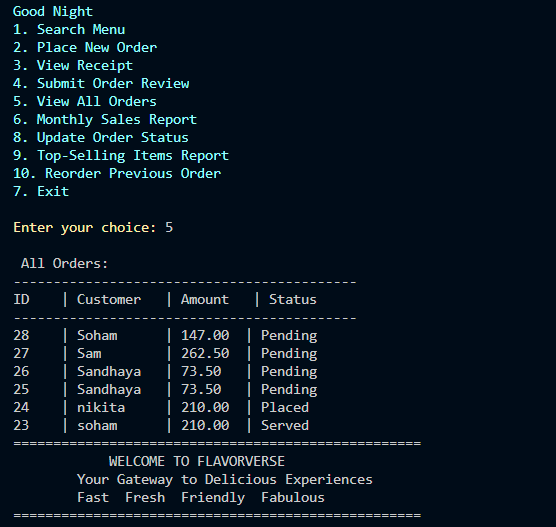
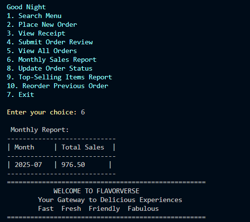
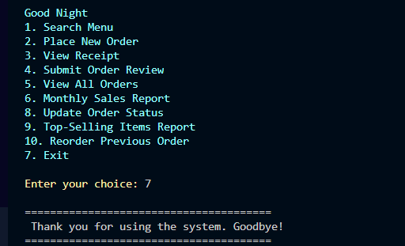

<p align="center">
  
</p>


# FLAVORVERSE — Java + JDBC Restaurant Order System

FLAVORVERSE is a feature-rich restaurant order management system built in Java using JDBC and MySQL. It supports role-based login for Admin and Users, dynamic menu search, order placement with discounts, real-time receipt generation, and detailed sales reporting. This project demonstrates practical use of database connectivity, SQL queries, and object-oriented programming in Java.

## Installation
1. Make sure you have **MySQL** installed and running.
2. Create a database named `unisoft`.
3. Run the SQL script to create tables (`users`, `menu`, `orders`, `order_items`, `reviews`, `discounts`) and insert sample data.

## Running the Program

1. Make sure you have **Java JDK 8+** installed.
2. Update the database credentials in `RestaurantOrderSystem.java` if needed.
3. Compile the program:
4. Run the program:


## ✨ Features

### 👥 User & Admin Roles
- 🔐 **Role-based Login System**: Seamless access for both Admins and Users.

### 🍽️ Menu & Ordering
- 🔎 **Smart Menu Search**: Find dishes by keyword.
- 🛍️ **Interactive Order Placement**: Add items to your cart with optional discount codes.
- 📃 **Receipt Generator**: View detailed order receipts with tax, emoji support, and final total.
- 🔁 **Reorder Past Orders**: Quickly repeat your favorite meals!

### 🗣️ Feedback System
- ⭐ **Review & Rate Orders**: Let your tastebuds speak!

### 🛠️ Admin Power Tools
- 📋 **View All Orders**: See complete order history.
- 📆 **Monthly Sales Report**: Get revenue insights.
- ⏳ **Update Order Status**: Mark orders as preparing, delivered, etc.
- 🏆 **Top-Selling Items Report**: Know what's trending on the menu.
- 📝 **Manage Customer Feedback**: View and analyze reviews.

## Technologies Used

- Java (JDK 8 or higher)
- MySQL database
- JDBC for database connectivity
- Maven or Gradle (optional, if you use build tools)
- Command-line interface for interaction

## 📝 Quick Notes
🧾 Requires mysql-connector-j JAR in your classpath for JDBC connectivity.

🧠 Make sure your MySQL port (default: 3306) is open and not blocked by firewall.

🖼️ GUI/CLI-based interactive terminal – runs in console, no external UI needed.


## 🚀 Setup Instructions
Follow these steps to get FLAVORVERSE up and running on your machine:

🔧 1. Install Prerequisites
Java JDK 8+
Download and install from Oracle JDK or use OpenJDK.

MySQL Server
Download from MySQL Downloads and install. Ensure it's running locally.

🛠️ 2. Create MySQL Database
Launch MySQL CLI or Workbench.

Run the following to create the required database:

sql
Copy
Edit
CREATE DATABASE unisoft;
(Optional) Use the provided .sql file to create tables and insert sample data.

🔐 3. Configure Database Connection
Open RestaurantOrderSystem.java.

Update the DB credentials as per your setup:

java
Copy
Edit
String url = "jdbc:mysql://localhost:3306/unisoft";
String username = "your_mysql_username";
String password = "your_mysql_password";
🧪 4. Compile & Run the App
Open the project in your favorite IDE (VS Code, IntelliJ, Eclipse) or use terminal:

bash
Copy
Edit
javac RestaurantOrderSystem.java
java RestaurantOrderSystem
💡 Pro Tip: For best experience, use a terminal that supports emoji display (like VS Code Terminal or Windows Terminal).

## Usage

1. Run the program using your IDE or from the command line:
   ```bash
   javac RestaurantOrderSystem.java
   java RestaurantOrderSystem


## Project Screenshots

### Main Page


### Place Order


### View Receipt


### Feedback


### Reorder Previous


### Status Update


### Top Selling Items


### View Orders


### Monthly Sales


### Exit

